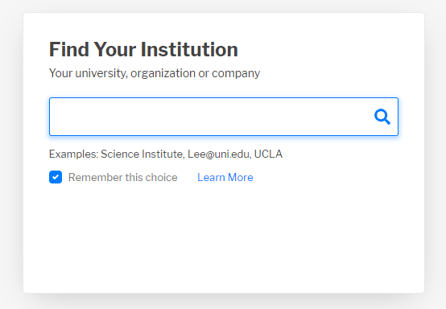

Connecting to the Hub

The hub supports a self-service assertion based on information learnt from the South African Indentity Federation (SAFIRE)

Logging into the hub

The hub requires you to login so that it can identify which institution who are associated with. It also writes some of the information collected via the login process to your ORCID record.

To start click on the login button in the top right had corner

Search for your institution in the search box .Your institution will be remembered on subsiquent visits, if you using the same device. It will not be remembered if you cleared your browser cache or using a new device.

  

Selecting your university will redirect you to your university's login page where you can login with your university credentials.

Once you have loggged in, the following information gets passed on to the Intembeko ORCID hub

- First Name Surname
- Email address
- Employement affiliation ( staff or student )

This information is need in the next step

 
