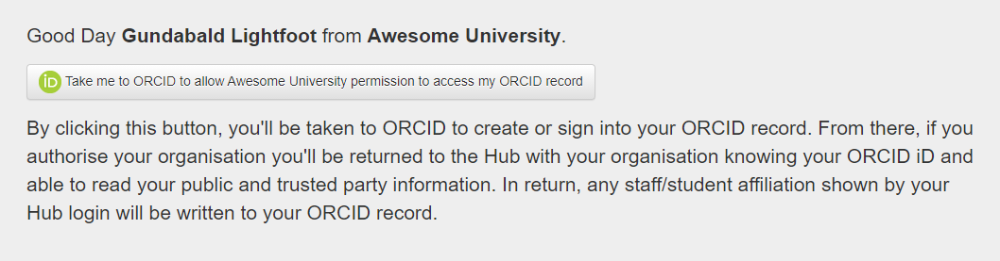
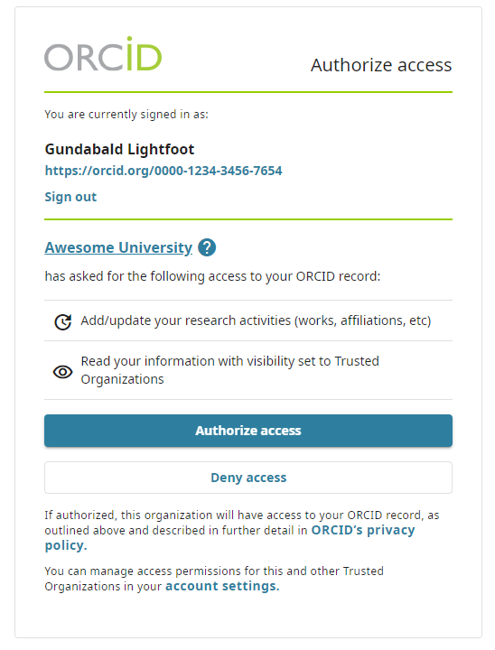
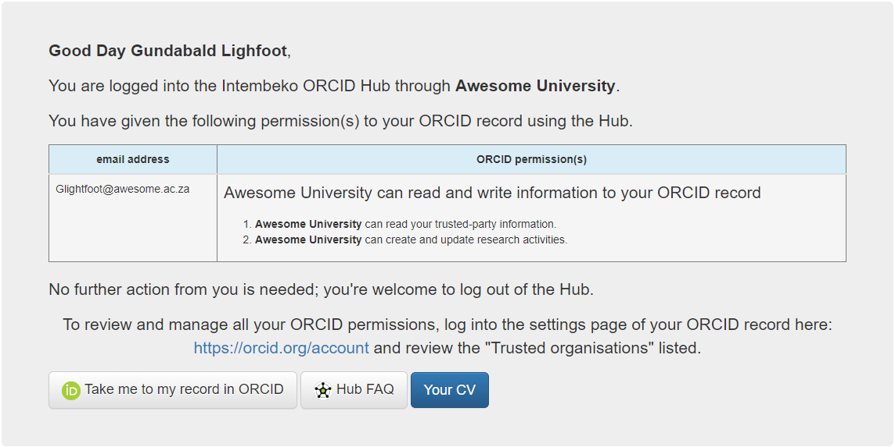
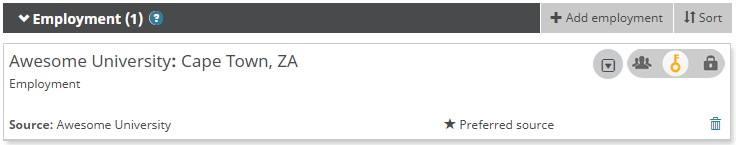

Once you you logged into the hub, you will be presented with a screen allowing you to connect your ORCID record.

This will take you to the login ORCID sign in page where you will be asked to give permissions for the Intembeko ORCID hub to read and write information into your ORCID record. It is advised to allow these permissions as gives your university the ability to write affiliated information into the record, but also allows your university to read information set as trust party so that information can reused in university application forms and systems so that you do not have to retype this.

Once you have given permission you will be returned to the hub where you will see a summary of the permissions you gave.

 

You can now log out of the hub.

If you have now logged into your ORCID record, you will see an affiliation from your university.

